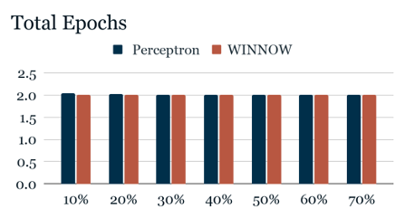
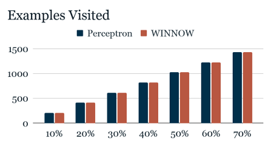
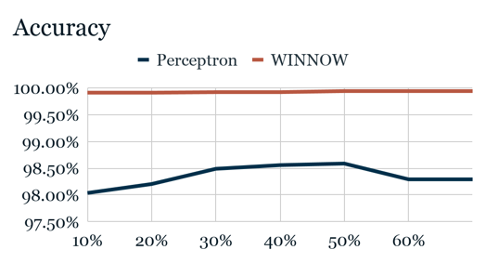
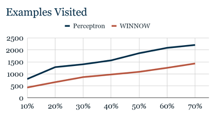
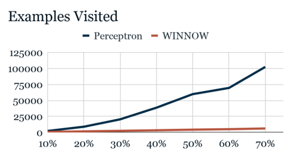
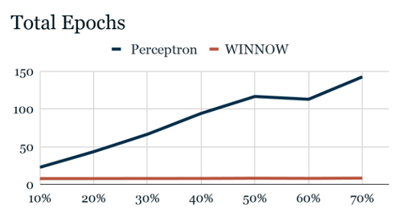
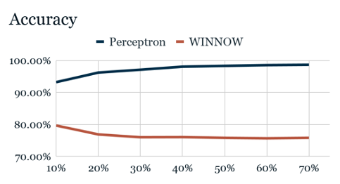
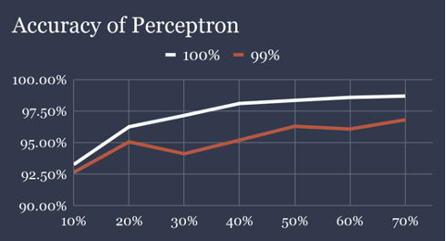
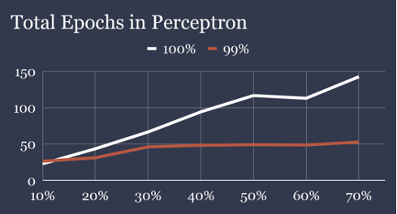
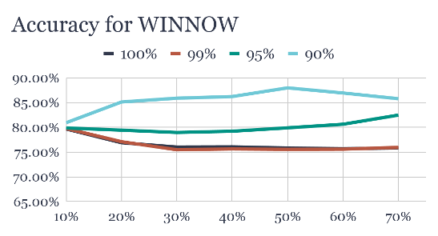

# Perceptron VS Winnow
## Comparing the efficiency of Perceptron vs the WINNOW Linear Classification Algorithm

Perceptron vs. WINNOW
by Daniel Portuondo

# Introduction

Perceptron and WINNOW, linear classifiers guaranteed to converge into a function that divides linearly separable data, are commonly used machine learning algorithms with countless real-world applications. These methods use a system of weights to uncover the dividing line, plane, or hyperplane dividing the classifications of an n-dimensional space. Both methods rely on relatively small parameters, labeled learning rate in perceptron and alpha in WINNOW, to alter the value of these weights. Although both methods are foundational similar, their core aspect is indeed what makes them so distinct. Perceptron, by nature, is additive, and WINNOW is conversely multiplicative.

   Perceptron’s weights, equal to the number of attributes in an instance space plus an additional bias attribute, must all be initialized to 0 or some randomly generated number. They are then each multiplied by the value of each corresponding attribute and summed together. It should be noted, of course, that attributes must convey numeric values, if not inherently then somehow manipulated to fit on the numeric spectrum. 
   
  Should the sum value of this calculation surpass the fixed threshold of 0, the example to which these attributes belong is labeled as positive (1 if the class is binary or whatever the class may be). Otherwise, it is labeled negative (or 0). This value, or prediction, is then compared against the true value of the example. If it is correct, the algorithm proceeds to the following example. If not, it works to learn from its mistakes through several adjustments.
If the hypothesis is higher than the classification – h(x) = 1 and c(x) = 0 – weights must be reduced by the learning rate, a number between 0 and 1 that can often sit well in the middle at 0.5.  If the inverse is true, then weights must be increased.

### wi = wi + η • [c(x) - h(x)]• xi

WINNOW, though it may abide by the same calculations to generate the hypothesis value, changes its weights in a drastically different manner. Should h(x) > c(x), the weights are divided by the alpha coefficient, a number which must be larger than 1. If the opposite should happen, the weights are thus multiplied by alpha. It must also be indicated that due to the nature of this method, WINNOW weights can approach 0 but never reach it or fall below it. 
### wi = wi • ⍺c(x)-h(x)

  Since, unlike perceptron, its weights cannot reach 0 or negative values, its attribute and weight sets must be configured differently. For every attribute value in a set, an opposing value attribute must be appended so that an example where x1 = 1 and x2 = 0 must create two additional attributes: x3 = 0 and x4 = 1. This results in a set of n * 2 total attributes and weights, where all weights are initialized to 1. The hypothesis value is consequently evaluated as 1 only if it surpasses a threshold of (n*2) – 0.1.
  
Of course, to describe the algorithms in the abstract fails to deliver their effectiveness and functionalities in the way concrete, data-backed examples created from experimentation can.  Thus, to best capture the value of these algorithms, let us create an artificial set of 10 Boolean attributes, resulting in an instance space of 1024 possibilities. 

# Experimental Design

  To ensure this data set would effectively represent the strengths and weaknesses of both algorithms, I needed to ensure two critical aspects on the data: (1) the data must be evenly split between positive and negative examples or close to it and (2) the data must be linearly separable. To achieve this, the first attempt at classifying this synthetic data took the form of Boolean functions. In other words, a function such as ( x1  ∧ ¬x7) ⋁ x9 would determine if a given example was positive or negative. While this may have worked for few relevant values, it grew increasingly difficult to achieve evenly split data as well to ensure the data was linearly separable. XNOR and XOR equations are fundamentally not linearly separable.
  
The next attempt simply involved true value counting. Should a minimum threshold of positive examples be achieved, the data was classified as true. However, this method, while making it easy to split data evenly, did not add weights to certain attributes and was too simple to solve. 

Ultimately, creating a customized formula such as 5.5x1 - 4.2x3 + 3.9x5 … allowed for an easy method to control weights and relevant attributes, making the underlying formula more challenging to uncover without increasing the difficulty of evenly splitting the data. 

  With this reliable method, the complete instance space was generated, classified, then randomly shuffled. The last 20% of the resulting data was pulled from the set and reserved for validation. The remaining 80% was then used as training data at increasing intervals of 10%. Initially, 10% of the data was pulled and filtered through both the perceptron and WINNOW algorithms. Another 10% was pulled, resulting in the filtering of 20% of the available training data, until the program reached 70% of the total instance space. At each interval, it was ensured that the data was consistently split between positives and negatives. This entire method was restarted and conducted 50 times and then averaged out to provide a cohesive figure of the data.
  
  During development, it was uncovered that the alpha values being used were far too high, resulting in an extensive and far too sensitive discovery process. A function to find the ideal coefficient dependent on training size data and relevant attribute count was thus implemented.
 
While the learning rate of perceptron does slightly decrease as the relevant attributes increase, it does not compare to the rate of change of alpha, with numbers quickly falling into the tenths and hundredths place. With these issues resolved, however, proper experiments could be conducted, and a vast amount of data could be generated.

# Presentation of Results and Discussion

The initial stages of the process began using between [1,3] relevant attributes. Due to their Boolean nature, their simplicity was far too easy to solve.
Using the following classification function:
### c(x) = 19.33 x0 -14.23 x8 -3.73x9

                         
The total iterations required to uncover the hyperplane were asynchronously consistent at 2 epochs, regardless of training data percentage or algorithm. Indeed, the only divergence resided in accuracy.

 
WINNOW provides near-perfect accuracy, while Perceptron falls behind by an average of about 1.5%. With our particular validation set, this translates to about 3 misclassifications by Perceptron.
	Indeed, Perceptron provided this formula:
### h(x) = 7x0 +0x1+ 0x2+0x3 + 0x4 +0x5 +0x6+0x7 + 1x8 -1x9 -2x10

 A cursory analysis of this formula suggests Perceptron determined any example in which x0 = 1 should be labeled as positive, as it would not be possible for the other corresponding weights to bring the value below zero, even if it was a combined effort. This being said, it does reflect the strength of x0 in the original function, as the other two combined could not prevent the value from surpassing 0. 
 
WINNOW appears to follow in the same path, similarly highlighting the strength of x0:
### h(x) = 16x0 +1x1+ 1x2+ 2x3 + 0.5x4 +2x5 +1x6+2x7 +2x8 + 1x9  + 0.625x10 + 1x11 + 1x12 + 0.5x13 +2x14 + 0.5x15 + 1x16 + 1x17 +.5x18 +1x19

Results truly started becoming interesting beyond this relevant attribute count. At 5 relevant attributes, the data reflected a key difference.

WINNOW does indeed continue to converge faster than Perceptron. However, its accuracy pivot below that of Perceptron, which remains just about as strong as at 3 relevant attributes. In fact, WINNOW suffered a notable average drop of -10% from its prior status. 

Using this classification function:
### c(x) = -3x1 + 10.53x4 + 5.1x5-8.42x7-2.5x9

Perceptron produced these weights:
### h(x) = 0x0 - 2x1 + 0x2 +0x3 + 10x4 + 7x5 + 0x6 -7x7 + 0x8 -3x9-2x10

The reader will note that this particular hypothesis function achieves a closer resemblance to the original function than at three relevant attributes, while the bias x10 aids in adjusting for imprecisions. 

With WINNOW’s weights:
### h(x) = 0.3x0 +0.01x1 + 0.2x2 + 0.2x3 + 14.2x4 + 8.4x5 + 0.3x6+ 0.005x7+ 0.2x8 + 0.01x9 + 0.1x10+ 2.9x11 + 0.2x12 + 0.2x13 + 0.003x14+ 0.005x15+ 0.12x16 + 8.4x17 + 0.2x18 + 2.9x19
	
Positive values from the classification function appear to be relatively reflected within the first 10 attributes, while negative values translate into floating point numbers closer to 0. However, within the second half of the hypothesis function, composed of the aforementioned opposing values, corresponding relevant weights are flipped. The c(x) positive values of x4 and x5 appear as 0.003x14 and 0.005x15 while negative values are more accurately reflected at x11,  x17 and x19.

Now, proceeding to the maximum number of relevant attributes within our domain, 10, results are drastically different than previously seen.

While the gap between Perceptron and WINNOW has grown exponentially, as expected, a strange occurrence can be observed. Previous examples have shown that as the training data percentage increases, the total epochs visited will naturally be reduced as the algorithms have significantly more data to work with per epoch than the prior training data to adjust their values. However, in this case, it seems Perceptron’s epoch count continues to grow, suggesting that, counter-intuitively, the algorithm finds it harder to converge the more data it is given. Perhaps just as surprising is the resulting accuracy. 

 
Accuracy diverges. Once again, counter-intuitively, the more data WINNOW is given, the less accurate it grows. This is because, until now, the program did not consider weights converged unless it completed a full epoch with 100% accuracy. This directive was thus too demanding in the case of perceptron and induced overfitting in the case of WINNOW. Both issues can be resolved by reducing the minimum accuracy to declare convergence.
 
 
 

By reducing the accuracy threshold by a single percentage point, the total epochs visited are reduced by almost 50%, while accuracy only under a -2% change. To one valuing speed and memory efficiency, this may be considered a good trade-off. Reducing the threshold even further showcases a significant change for WINNOW.

 
 
 As the accuracy threshold approaches 90% WINNOW’s accuracy increases and the overfitting is reduced.  Epochs and iterations decreased at a rate similar to perceptron until they plateau at 2. This method was applied to the 5 relevant attribute data, and as expected, WINNOW’s accuracy increased, nearly matching that of perceptron.

# Conclusion
From the collected data, it becomes evident that WINNOW’s strength lies in consistent efficiency while perceptron’s lies in consistent accuracy. Predictability, each one sacrifices the other’s strength in order to achieve their own. However, it is critical to note that in domains with fewer relevant attributes, WINNOW outperformed perceptron in both fields. Should the data set have been more complex than Boolean attributes, small relevant attributes would have assuredly depicted greater dissonance in epochs and examples visited between both algorithms.

In order to achieve this efficiency, WINNOW takes advantage of its multiplicative basis and alpha coefficient, which is drastically reduced as the relevant attributes increase. This is unakin to perceptron’s learning rate, which decreases at a minimal pace.
To enhance each algorithm’s respective weakness, one can reduce the minimum accuracy threshold for the algorithm to consider its weights converged. This can aid the process by simplifying perceptron’s expectations and preventing WINNOW from overfitting its data. By changing the accuracy threshold 99%, 95%, and 90%, one can observe as perceptron’s examples visited count decreases rapidly, albeit at the cost of accuracy, and WINNOW’s accuracy steadily increases while still improving its epoch count. 

Thus, a conclusive decision on the proper algorithm to use cannot be made. It is ultimately at the discretion of the needs and values of the developer or engineer to determine which option would be most effective to solve a given problem. This experiment provides a clearer picture of the respective strengths and weaknesses so that this decision can be made with increased information and confidence.
